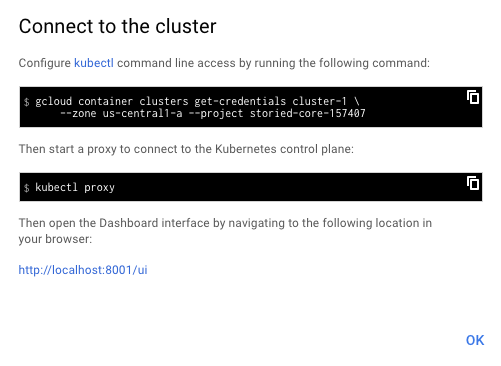

# Setup a Kubernetes cluster on Google Cloud Engine (GCE)

Main article: [Running Kubernetes on Google Compute
Engine](https://kubernetes.io/docs/getting-started-guides/gce/)

## 1. Create a cluster

The recommended way is to use [Google Container
Engine](https://cloud.google.com/container-engine/) (GKE). You should be able
to create a fully fledged cluster with just a few clicks.

## 2. Connect to it

Install `gcloud` as a part of [Google Cloud SDK](https://cloud.google.com/sdk/).

Make sure you have credentials for GCloud by running `gcloud auth login`.

In order to make API calls against GCE, you must also run `gcloud auth
application-default login`

Press `Connect` button:

and execute the first command in your shell. Then start a proxy by
executing `kubectl proxy`.

Now you should be able to run `kubectl` command to create resources, get
resource info, logs, etc.
